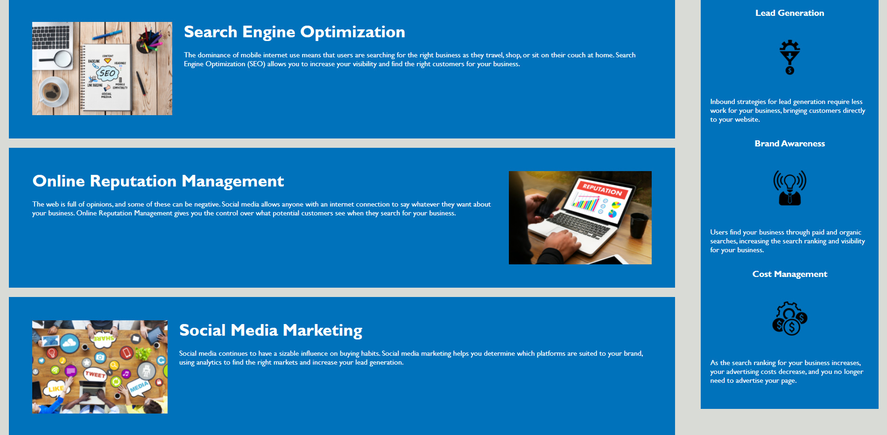

# <Horiseon_Marketing_Solutions>
## Description
In this project, I refactored the code for the web application of a fictional company, Horiseon Marketing Solutions. Horiseon wanted: 

1. their site to be more accessible to disabled users

2. semantic HTML to be implemented

3. their CSS style sheet's code to be cleaned up

4. any remaining miscellanious errors to be addressed

As such, I went through their app's HTML and CSS files, replacing div tags with more semantically appropriate selectors, adding alt text to images, improving the color contrast between the app's text and its background, fixing broken links, and eliminating dozens of redudant lines of code in the app's style sheet.

Screenshots of finished app:

- 

- 

Link to deployed app:

- [Horiseon Marketing Solutions](https://carterfm.github.io/Horiseon_Marketing_Solutions/#social-media-marketing)

